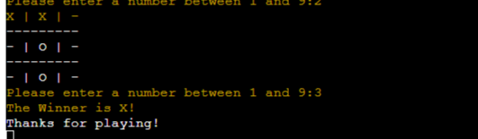

# Introduction 
## My Project
Hello, welcome to my game called Tic-Tac-Toe! 
In this project, the Tic-tac-toe is a game where two players take turns drawing either an "X" or an "O" in a grid of nine squares. The goal is to get three of your marks in a row, either horizontally, vertically, or diagonally. It's like a race to see who can get three in a row first! If nobody gets three in a row and all the squares are filled up, it's a tie. It's a simple and fun game to play with the computer!

# Contents
[User Stories](#user-stories "Go to User-stories")

[My Colour Schemes](#my-colour-schemes "Go to my-colour-schemes")

[My Features](#my-colour-schemes "Go to my-features")

[Deployment ](#deployment "Go to my-deployment")

[Testing and Code Validation](#testing-and-code-validation "Go to testing-and-code-validation")

[Credits and Codes](#credits-and-codes "Go to credits-and-codes")

## User Stories
### The goal of a first time user to the Tic-Tac-Toe game:
1. As a user to use the game for the first time, I'd like to be introduced to the game and be given clear instructions on how to play Tic-Tac-Toe.
2. I'd like to be shown a 3 by 3 grid. 
3. As a player, I'd like to see the scores being displayed on who's winning.
4. By the end, I'd like to find out if I or the computer has won. 

## My Colour Schemes 
I installed Coloroma from https://pypi.org/project/colorama as I'd like to add some color to my project. I aim to add red to my messages when a playerm runs into an error where if you don't put in a valid answer, you'll see an error such as "please enter numbers only!"

## FlowChart
This is my simple Tic-Tac-Toe flowchart 

## My Features
### Inputs 
I've included an input where the player must only put in a number from 1 to 9. 
My mentor suggested that I should try to include a while True and break to control the flow. That goes for all while loops.
The key for the if/else is that I must be careful about the order I check for the input. Reminding myself that first we check that the string input is a number before trying to use the input as an integer.

I've included a While Loop for at the end of my Python Project so that the game run will play in a same Loop. 

I've included an Else/if statement 

## Bugs and Issues
Throughout my project, I have encountered a numerous of issues.
My biggest one was when the Tic Tac Toe grid would not stop replicating itself everytime I put in the number. Hence why I imported the os system to try keep my game nice and clean 
See screenshots of the repeated grid:

Also applying to the red colorama was working but once the message was an error, the whole Tic-Tac-Toe stays red constantly. I would have to break this loop.

## Testing and Code Validation
In my testing, I validated my code by adding in the input that the answer must be an number. I tested by adding in a letter, a number greater than 9, and a special character.

I added in w to check.

I've added a number greater than nine

Added in a special character which was ???

I've also validated my code ny trying to take the computer's chosen spot, I get a message to say please choose spot as this is already picked 

I was able to get the Win result when i win the game.

## Deployment 
### GitHub:
How I deployed my project:

My project was deployed by using the Github pages. 

In order to get this done, here are the steps:

Firstly, go to the menu, and click the preffered repository

Click the settings button which can be easily identified by the gear icon in the menu right hand side. 

On the left hand side, scroll down until pages are seen in the Code and automation.

In the build and deployment section, click the Branch and a dropdown menu will appear, and chose the main branch

Click save after this step and a confirmation of deployment should be confirmed shortly. 

### Heroku: 
With the love from Love Sandwiches,
I deplyed my project Heroku by:

Throughtout the development, I manually deployed the project by Heroku. 

It meant that if i wanted to see the update, i would deploy each time.

In the add buildpack I made sure Python and Node.Js was included to check the functiaonlty of my project.

## Credits and Codes
Throughout the project I used these as a reference and guidance to help me understand python.
Links:
Code Coach https://www.youtube.com/watch?v=dK6gJw4-NCo

I've also researched using https://www.w3schools.com/python/default.asp

I've also found Love Sandwiches to be very helpful with my understanding of Python and the principles behind it.
Thank you to my mentor, Rory Patrick who has been super helpful throughout my project.

